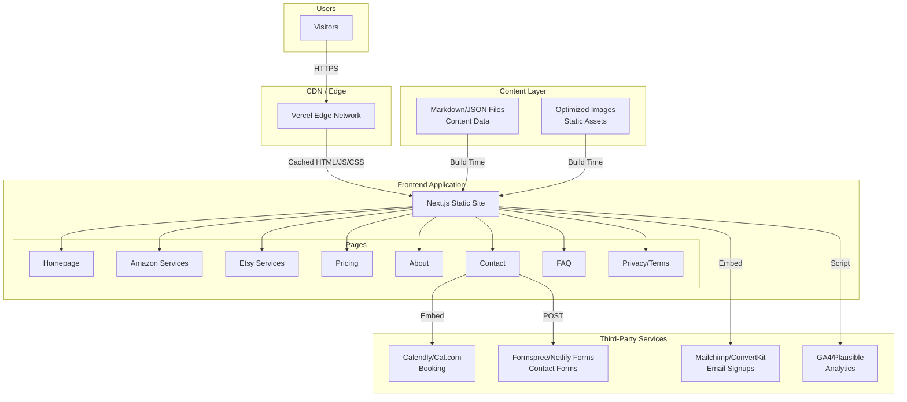
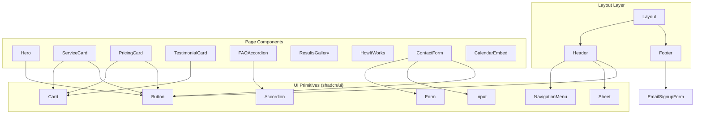
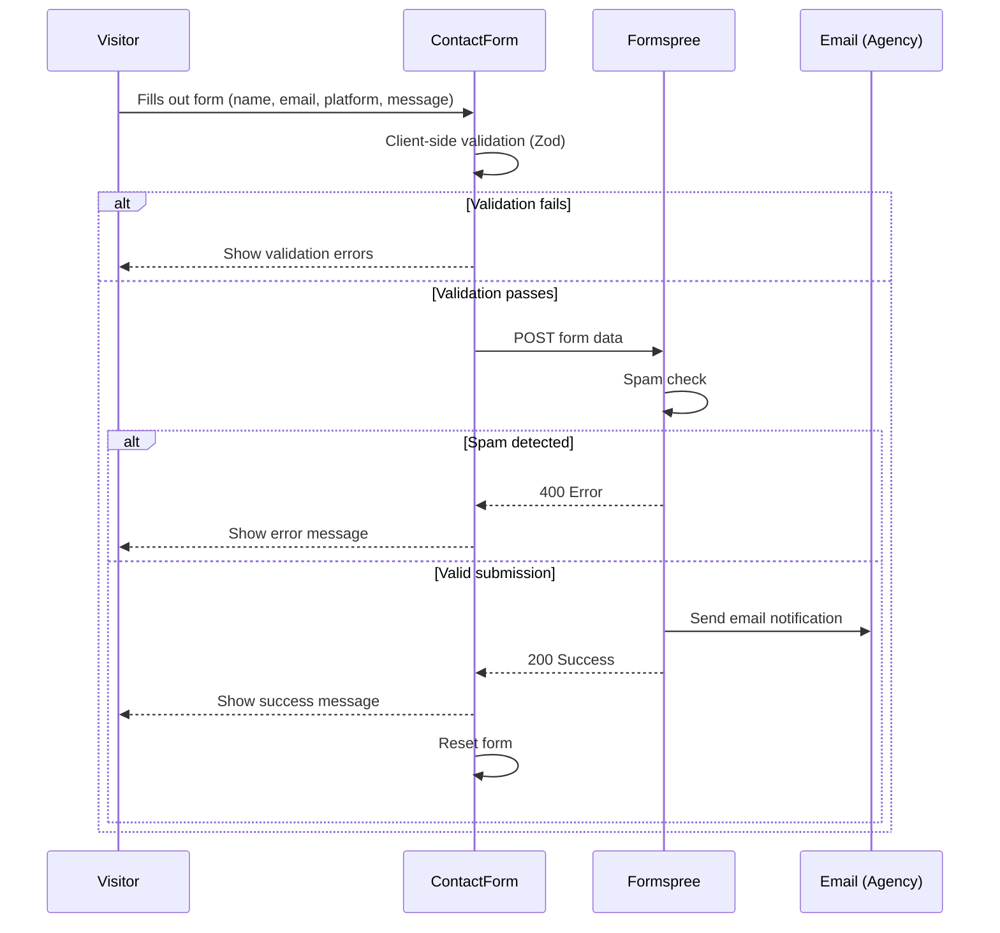
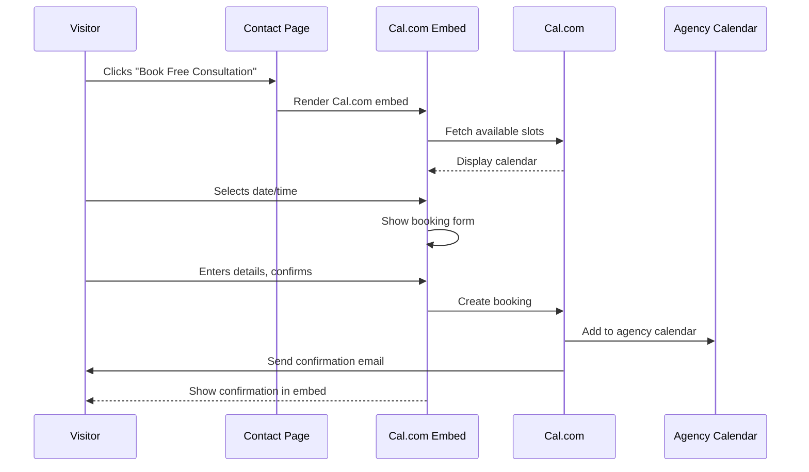
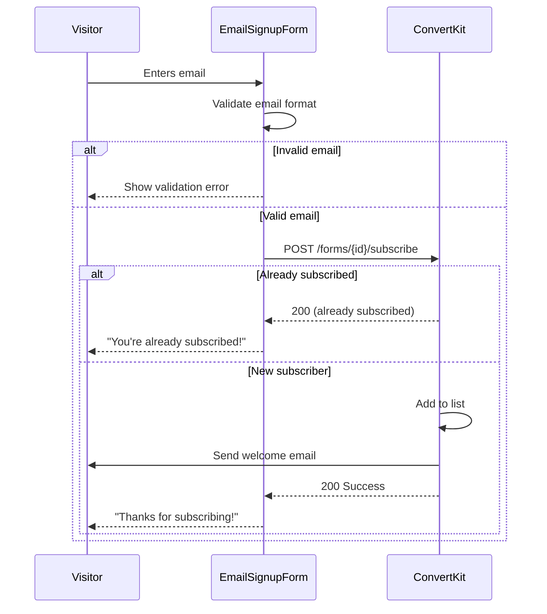
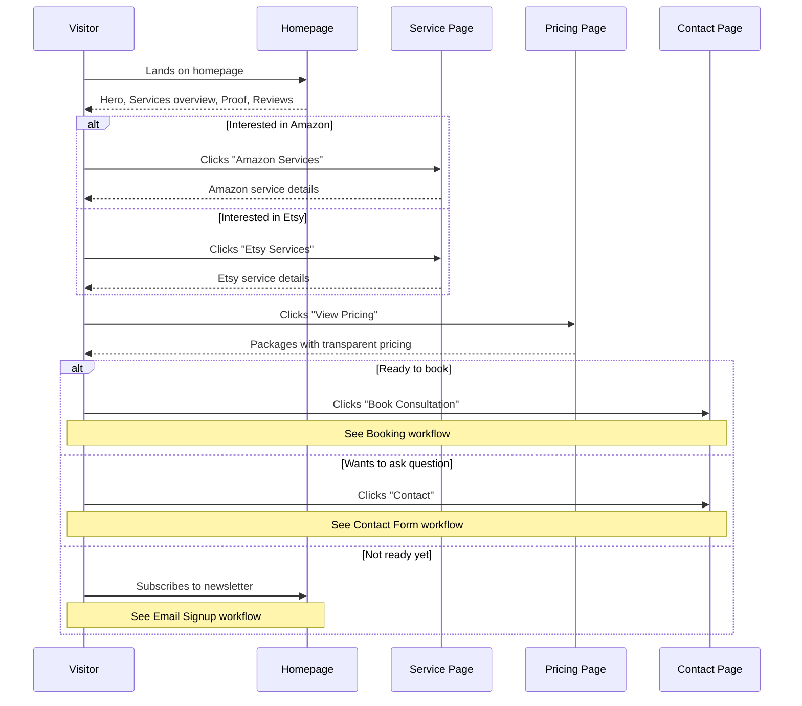
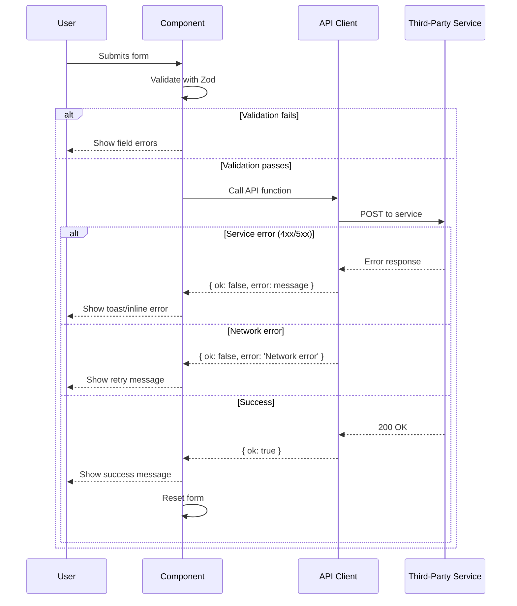

# Amazon/Etsy Consulting Agency Website Fullstack Architecture Document

## Introduction

This document outlines the complete fullstack architecture for the Amazon/Etsy Consulting Agency Website, including frontend systems, third-party integrations, and deployment infrastructure. It serves as the single source of truth for AI-driven development, ensuring consistency across the entire technology stack.

This is a **static-first JAMstack architecture** — a Next.js frontend with static export capability, no custom backend, and all dynamic functionality handled through third-party services (booking, forms, email, analytics). This unified approach streamlines development for a modern marketing/consulting website where performance, SEO, and conversion optimization are paramount.

### Starter Template or Existing Project

**N/A — Greenfield project**

The PRD specifies a fresh Next.js + Tailwind CSS implementation. No existing codebase or starter template constraints apply. We will establish the project structure and conventions from scratch, optimizing for the specific requirements of this consulting agency website.

### Change Log

| Date | Version | Description | Author |
|------|---------|-------------|--------|
| 2025-12-03 | 0.1 | Initial architecture draft | Architect Agent |

---

## High Level Architecture

### Technical Summary

This is a **static-generated Next.js website** deployed to Vercel, following JAMstack principles. The frontend is built with React/Next.js and Tailwind CSS, statically exported for optimal performance and SEO. There is no custom backend — all dynamic functionality (booking, forms, email capture, analytics) is handled through embedded third-party services. The architecture prioritizes sub-3-second load times, Lighthouse scores above 90, and seamless conversion paths from visitor to lead. Content is managed through file-based markdown/JSON, enabling non-technical updates without code deployments.

### Platform and Infrastructure Choice

**Platform:** Vercel
**Key Services:** Vercel Edge Network (CDN), Vercel Analytics (optional), GitHub Integration
**Deployment Regions:** Auto (Vercel's global edge network)

**Rationale for Vercel over alternatives:**

| Option | Pros | Cons |
|--------|------|------|
| **Vercel** ✓ | Native Next.js support, zero-config deploys, automatic SSL, global CDN, excellent DX | Vendor lock-in to Vercel-specific features if used |
| Netlify | Great for static sites, good form handling built-in | Less optimized for Next.js specifically |
| AWS (S3 + CloudFront) | Full control, enterprise scale | Overkill for this project, more complex setup |

**Decision:** Vercel is the optimal choice given Next.js is the framework and the PRD explicitly lists "Vercel or Netlify" as recommended. Vercel's native Next.js integration provides the best developer experience and performance optimization.

### Repository Structure

**Structure:** Monorepo (single repository)
**Monorepo Tool:** N/A — npm workspaces not needed for this scale
**Package Organization:** Flat structure with clear directory separation

The PRD specifies a monorepo containing "all website code, components, content, and configuration." Given this is a single Next.js application with no backend services, a simple flat structure is appropriate rather than a multi-package monorepo.

### High Level Architecture Diagram



### Architectural Patterns

- **JAMstack Architecture:** Pre-rendered static pages with client-side JavaScript for interactivity and third-party APIs for dynamic features — *Rationale:* Maximizes performance (static files served from CDN), improves SEO (fully rendered HTML), and reduces infrastructure complexity (no server to manage)

- **Static Site Generation (SSG):** All pages pre-built at build time using Next.js static export — *Rationale:* Meets the <3 second load time requirement and Lighthouse >90 targets; content doesn't change frequently enough to require ISR or SSR

- **Component-Based UI:** Reusable React components with TypeScript for type safety — *Rationale:* Enables consistent UI across pages, reduces duplication, and provides developer confidence through type checking

- **File-Based Content Management:** Content stored in markdown/JSON files within the repository — *Rationale:* PRD specifies "simple file-based system" for non-technical updates; avoids headless CMS complexity for MVP while allowing content changes via PR

- **Third-Party Service Integration:** All dynamic functionality (forms, booking, email, analytics) delegated to specialized services — *Rationale:* Eliminates need for custom backend, reduces development time, leverages battle-tested solutions for critical conversion paths

- **Mobile-First Responsive Design:** Tailwind CSS utility classes with mobile-first breakpoints — *Rationale:* PRD requires "full mobile responsiveness"; mobile-first ensures touch targets and layouts work on smallest screens first

---

## Tech Stack

This is the **definitive technology selection** for the project. All development must use these exact technologies and versions.

| Category | Technology | Version | Purpose | Rationale |
|----------|------------|---------|---------|-----------|
| Frontend Language | TypeScript | 5.x | Type-safe JavaScript | PRD specifies TypeScript; catches errors at build time |
| Frontend Framework | Next.js | 14.x | React framework with SSG | PRD recommendation; optimal static export + image optimization |
| UI Component Library | shadcn/ui | latest | Accessible, styled components | Built on Radix UI + Tailwind; copy-paste components, full customization, excellent a11y |
| State Management | React Context | Built-in | Light global state | No complex state needs; Context sufficient for menu/modal states |
| CSS Framework | Tailwind CSS | 3.x | Utility-first styling | PRD specified; rapid development, easy responsive design |
| Backend Language | N/A | - | No custom backend | Static site with third-party integrations only |
| Backend Framework | N/A | - | No custom backend | All dynamic features via third-party services |
| API Style | N/A | - | No custom API | Forms/booking handled by third-party services |
| Database | N/A | - | No database | Content in markdown/JSON files |
| Cache | Vercel Edge | Managed | CDN caching | Automatic with Vercel deployment |
| File Storage | Git + Vercel | Managed | Static assets | Images in /public, optimized at build |
| Authentication | N/A | - | No auth required | Public marketing site |
| Frontend Testing | Vitest + Testing Library | 1.x / 14.x | Component unit tests | Fast, modern, React-focused |
| Backend Testing | N/A | - | No backend | - |
| E2E Testing | Playwright | 1.x | Critical path testing | PRD specifies light E2E coverage |
| Build Tool | Next.js CLI | 14.x | Build orchestration | Built into Next.js |
| Bundler | Turbopack/Webpack | Built-in | Module bundling | Next.js default; Turbopack for dev speed |
| IaC Tool | N/A | - | Not needed | Vercel handles infrastructure |
| CI/CD | GitHub Actions | - | Automated testing/deploy | Industry standard; free for public repos |
| Monitoring | Vercel Analytics | Managed | Performance monitoring | Native integration, Core Web Vitals |
| Logging | Console + Vercel Logs | Managed | Debug logging | Sufficient for static site |

### Third-Party Service Stack

| Service Type | Selected Option | Alternative | Purpose |
|--------------|-----------------|-------------|---------|
| Booking/Calendar | Cal.com | Calendly | Free consultation scheduling |
| Contact Forms | Formspree | Netlify Forms | Lead capture and inquiries |
| Email Marketing | ConvertKit | Mailchimp | Newsletter signups |
| Analytics | Plausible | GA4 | Privacy-friendly traffic tracking |
| Cookie Consent | Cookie Consent JS | Osano | GDPR compliance |

---

## Data Models

Since this is a static marketing site with no database, our "data models" are the **content structures** stored in JSON files that get processed at build time.

### Content Model

**Purpose:** Represents all editable content on the site that non-technical stakeholders may need to update.

**Key Attributes:**
- `services`: Service[] - List of services for Amazon and Etsy pages
- `pricing`: PricingPackage[] - Pricing tiers for each platform
- `testimonials`: Testimonial[] - Customer reviews
- `faqs`: FAQ[] - Frequently asked questions
- `team`: TeamMember[] - About page team info
- `siteConfig`: SiteConfig - Global site settings

### TypeScript Interfaces

```typescript
// content/types.ts

/**
 * Represents a service offering for Amazon or Etsy sellers.
 * Used throughout the site for service cards, listings, and detail pages.
 */
export interface Service {
  /** Unique identifier for the service */
  id: string;
  /** Target marketplace platform */
  platform: 'amazon' | 'etsy';
  /** Display title for the service */
  title: string;
  /** Brief description shown on service cards */
  description: string;
  /** Icon name from the icon library */
  icon: string;
  /** List of features included in this service */
  features: string[];
}

/**
 * Pricing package for a specific platform or bundle.
 * Displayed on the pricing page and pricing preview sections.
 */
export interface PricingPackage {
  /** Unique identifier for the package */
  id: string;
  /** Platform this package applies to, or 'bundle' for multi-platform */
  platform: 'amazon' | 'etsy' | 'bundle';
  /** Package tier name (e.g., "Starter", "Growth", "Premium") */
  name: string;
  /** Price in USD (whole dollars) */
  price: number;
  /** Formatted price label for display (e.g., "$499/mo") */
  priceLabel: string;
  /** Brief package description */
  description: string;
  /** List of features included in the package */
  features: string[];
  /** Whether to highlight this as the recommended option */
  isPopular?: boolean;
  /** Call-to-action button text */
  ctaText: string;
  /** Call-to-action button link */
  ctaLink: string;
}

/**
 * Customer testimonial for social proof.
 * Displayed on homepage and potentially dedicated testimonials section.
 */
export interface Testimonial {
  /** Unique identifier for the testimonial */
  id: string;
  /** The testimonial quote text */
  quote: string;
  /** Customer's name (can be anonymized) */
  authorName: string;
  /** Customer's business name (optional) */
  authorBusiness?: string;
  /** Platform the customer sells on */
  platform: 'amazon' | 'etsy';
  /** URL to customer's avatar image (optional) */
  avatarUrl?: string;
}

/**
 * Frequently asked question item.
 * Displayed in FAQ accordion on homepage preview and dedicated FAQ page.
 */
export interface FAQ {
  /** Unique identifier for the FAQ */
  id: string;
  /** The question text */
  question: string;
  /** The answer text (supports markdown) */
  answer: string;
  /** Optional category for grouping */
  category?: 'general' | 'amazon' | 'etsy' | 'pricing';
}

/**
 * Team member information for About page.
 */
export interface TeamMember {
  /** Unique identifier for the team member */
  id: string;
  /** Team member's name */
  name: string;
  /** Job title or role */
  role: string;
  /** Brief biography */
  bio: string;
  /** URL to profile image (optional) */
  imageUrl?: string;
  /** Social media links (optional) */
  socialLinks?: {
    linkedin?: string;
    twitter?: string;
  };
}

/**
 * Dashboard screenshot or result proof.
 * Displayed in the Results/Proof section to demonstrate real client outcomes.
 */
export interface ResultProof {
  /** Unique identifier for the result */
  id: string;
  /** Platform the result is from */
  platform: 'amazon' | 'etsy';
  /** URL to the dashboard screenshot image */
  imageUrl: string;
  /** Alt text for accessibility */
  altText: string;
  /** Caption describing the result (e.g., "3x sales growth in 6 months") */
  caption: string;
}

/**
 * Global site configuration.
 * Contains settings used across multiple pages.
 */
export interface SiteConfig {
  /** Site name for branding */
  siteName: string;
  /** Tagline displayed in footer and meta */
  tagline: string;
  /** Primary contact email */
  contactEmail: string;
  /** Contact phone number (optional) */
  phone?: string;
  /** Physical address (optional) */
  address?: string;
  /** Social media profile links */
  socialLinks: {
    instagram?: string;
    linkedin?: string;
    twitter?: string;
  };
  /** Cal.com booking URL */
  calendarBookingUrl: string;
  /** Formspree form endpoint */
  formspreeEndpoint: string;
  /** ConvertKit/email signup endpoint */
  emailSignupEndpoint: string;
}
```

### Relationships

- `Service` → belongs to a `platform` (amazon/etsy)
- `PricingPackage` → belongs to a `platform` (amazon/etsy/bundle)
- `Testimonial` → associated with a `platform`
- `FAQ` → optionally categorized by topic
- `ResultProof` → associated with a `platform`

### Content File Structure

```
content/
├── services/
│   ├── amazon.json       # Amazon services array
│   └── etsy.json         # Etsy services array
├── pricing/
│   └── packages.json     # All pricing packages
├── testimonials.json     # Customer testimonials
├── faqs.json             # FAQ items
├── team.json             # Team members
├── results.json          # Dashboard screenshots/proofs
└── site-config.json      # Global site configuration
```

---

## API Specification

**This section is N/A for this project.**

There is no custom API — this is a static site with all dynamic functionality handled by third-party services:

| Function | Service | Integration Method |
|----------|---------|-------------------|
| Contact Form Submission | Formspree | Form `action` POST to Formspree endpoint |
| Consultation Booking | Cal.com | Embedded iframe/widget |
| Email Signup | ConvertKit | Embedded form or API POST |
| Analytics | Plausible | Script tag inclusion |

### Third-Party Endpoints (Reference)

```typescript
// lib/config.ts

export const endpoints = {
  // Formspree - Contact form submissions
  contactForm: 'https://formspree.io/f/{form_id}',

  // ConvertKit - Email signups
  emailSignup: 'https://api.convertkit.com/v3/forms/{form_id}/subscribe',

  // Cal.com - Booking embed
  calendarEmbed: 'https://cal.com/{username}/{event-type}',

  // Plausible - Analytics (script src)
  analytics: 'https://plausible.io/js/script.js',
} as const;
```

These endpoints will be configured via environment variables for flexibility across environments.

---

## Components

### Component List

#### Layout Components

**Header**
- **Responsibility:** Sticky navigation bar with logo, main nav, mobile hamburger menu
- **Key Interfaces:** `NavItem[]`, `isMenuOpen` state
- **Dependencies:** Logo component, NavLink, MobileMenu
- **Technology Stack:** React, Tailwind, Headless UI (for mobile menu), shadcn/ui Sheet

**Footer**
- **Responsibility:** Site footer with contact info, social links, email signup, legal links
- **Key Interfaces:** `SiteConfig`, `EmailSignupForm`
- **Dependencies:** SocialIcons, EmailSignupForm, NavLink
- **Technology Stack:** React, Tailwind, ConvertKit embed

**Layout**
- **Responsibility:** Page wrapper combining Header + main + Footer
- **Key Interfaces:** `children: ReactNode`, `metadata?: PageMeta`
- **Dependencies:** Header, Footer, SEO component
- **Technology Stack:** Next.js layout pattern

#### UI Components (shadcn/ui based)

**Button**
- **Responsibility:** Primary, secondary, outline button variants
- **Key Interfaces:** `variant`, `size`, `asChild`
- **Dependencies:** shadcn/ui Button primitive
- **Technology Stack:** React, Tailwind, Radix Slot

**Card**
- **Responsibility:** Content cards for services, pricing, testimonials
- **Key Interfaces:** `CardHeader`, `CardContent`, `CardFooter`
- **Dependencies:** shadcn/ui Card
- **Technology Stack:** React, Tailwind

**Accordion**
- **Responsibility:** Expandable FAQ items
- **Key Interfaces:** `AccordionItem`, `AccordionTrigger`, `AccordionContent`
- **Dependencies:** shadcn/ui Accordion (Radix)
- **Technology Stack:** React, Tailwind, Radix Accordion

**Sheet**
- **Responsibility:** Mobile navigation drawer
- **Key Interfaces:** `SheetTrigger`, `SheetContent`
- **Dependencies:** shadcn/ui Sheet (Radix Dialog)
- **Technology Stack:** React, Tailwind, Radix Dialog

**NavigationMenu**
- **Responsibility:** Desktop navigation with dropdowns
- **Key Interfaces:** `NavigationMenuItem`, `NavigationMenuTrigger`
- **Dependencies:** shadcn/ui NavigationMenu (Radix)
- **Technology Stack:** React, Tailwind, Radix NavigationMenu

#### Page Section Components

**Hero**
- **Responsibility:** Homepage hero with headline, subheadline, CTAs, illustration
- **Key Interfaces:** `headline`, `subheadline`, `primaryCta`, `secondaryCta`, `imageUrl`
- **Dependencies:** Button, Next/Image
- **Technology Stack:** React, Tailwind, Next.js Image

**ServiceCard**
- **Responsibility:** Platform service overview card (Amazon/Etsy)
- **Key Interfaces:** `Service` type
- **Dependencies:** Card, Icon, Button
- **Technology Stack:** React, Tailwind

**PricingCard**
- **Responsibility:** Pricing package display with features list
- **Key Interfaces:** `PricingPackage` type
- **Dependencies:** Card, Button, CheckIcon
- **Technology Stack:** React, Tailwind

**TestimonialCard**
- **Responsibility:** Customer review display
- **Key Interfaces:** `Testimonial` type
- **Dependencies:** Card, Avatar
- **Technology Stack:** React, Tailwind

**FAQAccordion**
- **Responsibility:** FAQ section with expandable items
- **Key Interfaces:** `FAQ[]`
- **Dependencies:** Accordion
- **Technology Stack:** React, Tailwind, Radix

**ResultsGallery**
- **Responsibility:** Dashboard screenshot gallery
- **Key Interfaces:** `ResultProof[]`
- **Dependencies:** Next/Image, lightbox (optional)
- **Technology Stack:** React, Tailwind, Next.js Image

**HowItWorks**
- **Responsibility:** Step-by-step process visualization
- **Key Interfaces:** `steps: Step[]`
- **Dependencies:** Icon, custom step connector
- **Technology Stack:** React, Tailwind

#### Form Components

**ContactForm**
- **Responsibility:** Contact form with validation and submission
- **Key Interfaces:** `onSubmit`, form fields
- **Dependencies:** shadcn/ui Form, Input, Textarea, Select, Button
- **Technology Stack:** React, Tailwind, React Hook Form, Zod, Formspree

**EmailSignupForm**
- **Responsibility:** Newsletter signup (footer + contact page)
- **Key Interfaces:** `onSubmit`, `email` field
- **Dependencies:** Input, Button
- **Technology Stack:** React, Tailwind, ConvertKit API

**CalendarEmbed**
- **Responsibility:** Consultation booking widget
- **Key Interfaces:** `calendarUrl`
- **Dependencies:** Cal.com embed script
- **Technology Stack:** React, Cal.com SDK

### Component Diagram



---

## External APIs

### Cal.com API

- **Purpose:** Free consultation booking/scheduling
- **Documentation:** https://cal.com/docs
- **Base URL(s):** https://cal.com, https://api.cal.com/v1
- **Authentication:** API key for API access; embed requires no auth
- **Rate Limits:** Generous for embed usage; API has standard limits

**Key Endpoints Used:**
- Embed only — `<Cal>` React component or iframe embed
- No direct API calls needed for MVP

**Integration Notes:** Use Cal.com's React component (`@calcom/embed-react`) for seamless embedding. Style customization available through embed parameters.

---

### Formspree API

- **Purpose:** Contact form submission handling
- **Documentation:** https://formspree.io/docs
- **Base URL(s):** https://formspree.io/f/{form_id}
- **Authentication:** Form ID in URL; no API key for form submissions
- **Rate Limits:** 50 submissions/month (free tier); 1000/month (paid)

**Key Endpoints Used:**
- `POST https://formspree.io/f/{form_id}` — Submit contact form

**Integration Notes:** Simple form POST; supports AJAX submissions. Returns JSON response for success/error handling. Spam filtering included.

---

### ConvertKit API

- **Purpose:** Email newsletter signups
- **Documentation:** https://developers.convertkit.com/
- **Base URL(s):** https://api.convertkit.com/v3
- **Authentication:** API key (public for form subscriptions)
- **Rate Limits:** Standard API limits; generous for form subscriptions

**Key Endpoints Used:**
- `POST /forms/{form_id}/subscribe` — Add email subscriber

**Integration Notes:** Can use embed form (simpler) or API call (more control over UX). API allows custom success handling without redirect.

---

### Plausible Analytics

- **Purpose:** Privacy-friendly website analytics
- **Documentation:** https://plausible.io/docs
- **Base URL(s):** https://plausible.io
- **Authentication:** Script tag with domain; API key for stats API
- **Rate Limits:** N/A for tracking; API has limits

**Key Endpoints Used:**
- Script inclusion only: `<script src="https://plausible.io/js/script.js" data-domain="yourdomain.com">`
- Optional: Events API for custom goal tracking

**Integration Notes:** No cookies by default (GDPR-friendly). Custom events can track form submissions, booking clicks. EU-hosted option available.

---

## Core Workflows

### Workflow 1: Contact Form Submission



### Workflow 2: Consultation Booking



### Workflow 3: Email Newsletter Signup



### Workflow 4: Visitor Journey (Homepage to Lead)



---

## Database Schema

**This section is N/A for this project.**

There is no database. All content is stored in JSON files within the repository and processed at build time.

### Content Storage (File-Based)

Instead of database tables, we have JSON files:

| "Table" Equivalent | File Location | Structure |
|-------------------|---------------|-----------|
| Services | `content/services/amazon.json`, `content/services/etsy.json` | `Service[]` |
| Pricing | `content/pricing/packages.json` | `PricingPackage[]` |
| Testimonials | `content/testimonials.json` | `Testimonial[]` |
| FAQs | `content/faqs.json` | `FAQ[]` |
| Team | `content/team.json` | `TeamMember[]` |
| Results | `content/results.json` | `ResultProof[]` |
| Site Config | `content/site-config.json` | `SiteConfig` |

### Content Access Pattern

```typescript
// lib/content.ts

import amazonServices from '@/content/services/amazon.json';
import etsyServices from '@/content/services/etsy.json';
import packages from '@/content/pricing/packages.json';
import testimonials from '@/content/testimonials.json';
import faqs from '@/content/faqs.json';
import team from '@/content/team.json';
import results from '@/content/results.json';
import siteConfig from '@/content/site-config.json';

import type { Service, PricingPackage, Testimonial, FAQ, TeamMember, ResultProof, SiteConfig } from './types';

/**
 * Retrieves all Amazon services from the content store.
 * Services are sorted by display order.
 *
 * @returns Array of Amazon-specific services
 */
export const getAmazonServices = (): Service[] => amazonServices;

/**
 * Retrieves all Etsy services from the content store.
 * Services are sorted by display order.
 *
 * @returns Array of Etsy-specific services
 */
export const getEtsyServices = (): Service[] => etsyServices;

/**
 * Retrieves all services across both platforms.
 *
 * @returns Combined array of Amazon and Etsy services
 */
export const getAllServices = (): Service[] => [...amazonServices, ...etsyServices];

/**
 * Filters pricing packages by platform.
 *
 * @param platform - Optional platform filter ('amazon', 'etsy', or 'bundle')
 * @returns Filtered array of pricing packages, or all packages if no filter
 */
export const getPricingPackages = (platform?: 'amazon' | 'etsy' | 'bundle'): PricingPackage[] =>
  platform ? packages.filter(p => p.platform === platform) : packages;

/**
 * Retrieves all customer testimonials.
 *
 * @returns Array of testimonials
 */
export const getTestimonials = (): Testimonial[] => testimonials;

/**
 * Retrieves FAQs, optionally filtered by category.
 *
 * @param category - Optional category filter
 * @returns Filtered array of FAQs, or all FAQs if no filter
 */
export const getFAQs = (category?: string): FAQ[] =>
  category ? faqs.filter(f => f.category === category) : faqs;

/**
 * Retrieves all team members for the About page.
 *
 * @returns Array of team members
 */
export const getTeam = (): TeamMember[] => team;

/**
 * Retrieves all result proof items (dashboard screenshots).
 *
 * @returns Array of result proofs
 */
export const getResults = (): ResultProof[] => results;

/**
 * Retrieves the global site configuration.
 *
 * @returns Site configuration object
 */
export const getSiteConfig = (): SiteConfig => siteConfig;
```

---

## Frontend Architecture

### Component Architecture

#### Component Organization

```
src/
├── components/
│   ├── ui/                    # shadcn/ui components (primitives)
│   │   ├── button.tsx
│   │   ├── card.tsx
│   │   ├── accordion.tsx
│   │   ├── sheet.tsx
│   │   ├── navigation-menu.tsx
│   │   ├── input.tsx
│   │   ├── textarea.tsx
│   │   ├── select.tsx
│   │   ├── form.tsx
│   │   └── ...
│   ├── layout/                # Layout components
│   │   ├── header.tsx
│   │   ├── footer.tsx
│   │   ├── mobile-nav.tsx
│   │   └── container.tsx
│   ├── sections/              # Page section components
│   │   ├── hero.tsx
│   │   ├── services-overview.tsx
│   │   ├── how-it-works.tsx
│   │   ├── why-choose-us.tsx
│   │   ├── results-gallery.tsx
│   │   ├── testimonials.tsx
│   │   ├── pricing-preview.tsx
│   │   └── faq-preview.tsx
│   ├── cards/                 # Reusable card components
│   │   ├── service-card.tsx
│   │   ├── pricing-card.tsx
│   │   └── testimonial-card.tsx
│   └── forms/                 # Form components
│       ├── contact-form.tsx
│       ├── email-signup-form.tsx
│       └── calendar-embed.tsx
```

#### Component Template

```typescript
// components/cards/service-card.tsx

import { Card, CardHeader, CardContent, CardFooter } from '@/components/ui/card';
import { Button } from '@/components/ui/button';
import type { Service } from '@/lib/types';

/**
 * Props for the ServiceCard component.
 */
interface ServiceCardProps {
  /** The service to display */
  service: Service;
}

/**
 * Displays a service offering in a card format.
 * Used on homepage services overview and platform-specific service pages.
 *
 * @param props - Component props
 * @param props.service - The service data to display
 *
 * @example
 * ```tsx
 * <ServiceCard service={amazonServices[0]} />
 * ```
 */
export function ServiceCard({ service }: ServiceCardProps) {
  return (
    <Card className="flex flex-col h-full">
      <CardHeader>
        <div className="w-12 h-12 mb-4">
          {/* Icon component */}
        </div>
        <h3 className="text-xl font-semibold">{service.title}</h3>
      </CardHeader>
      <CardContent className="flex-grow">
        <p className="text-muted-foreground">{service.description}</p>
      </CardContent>
      <CardFooter>
        <Button variant="outline" className="w-full">
          Learn More
        </Button>
      </CardFooter>
    </Card>
  );
}
```

### State Management Architecture

#### State Structure

```typescript
// No global state store needed for MVP
// Local component state handles:
// - Mobile menu open/close
// - Accordion expanded states
// - Form input values
// - Form submission status

// Example: Form submission state
interface FormState {
  status: 'idle' | 'submitting' | 'success' | 'error';
  errorMessage?: string;
}

// Example: Mobile nav state
interface MobileNavState {
  isOpen: boolean;
}
```

#### State Management Patterns

- **Local state (useState)** for UI interactions (menu, accordion, modals)
- **Form state (React Hook Form)** for all forms with Zod validation
- **No global store** — No complex state sharing requirements
- **URL state** — Active page derived from Next.js router
- **Server state** — N/A (no data fetching; all content is static)

### Routing Architecture

#### Route Organization

```
app/
├── layout.tsx              # Root layout (Header + Footer)
├── page.tsx                # Homepage (/)
├── services/
│   ├── amazon/
│   │   └── page.tsx        # Amazon Services (/services/amazon)
│   └── etsy/
│       └── page.tsx        # Etsy Services (/services/etsy)
├── pricing/
│   └── page.tsx            # Pricing (/pricing)
├── about/
│   └── page.tsx            # About Us (/about)
├── contact/
│   └── page.tsx            # Contact (/contact)
├── faq/
│   └── page.tsx            # FAQ (/faq)
├── privacy/
│   └── page.tsx            # Privacy Policy (/privacy)
└── terms/
    └── page.tsx            # Terms of Service (/terms)
```

#### Protected Route Pattern

**N/A** — No protected routes; this is a public marketing site with no authentication.

### Frontend Services Layer

#### API Client Setup

```typescript
// lib/api/formspree.ts

const FORMSPREE_ENDPOINT = process.env.NEXT_PUBLIC_FORMSPREE_ENDPOINT!;

/**
 * Contact form data structure.
 */
export interface ContactFormData {
  /** Visitor's full name */
  name: string;
  /** Visitor's email address */
  email: string;
  /** Platform they're interested in */
  platform: 'amazon' | 'etsy' | 'both';
  /** Their message or inquiry */
  message: string;
}

/**
 * Submits contact form data to Formspree.
 * Handles network errors and returns a standardized response.
 *
 * @param data - The validated contact form data
 * @returns Promise resolving to success/error response
 *
 * @example
 * ```ts
 * const result = await submitContactForm({
 *   name: 'John Doe',
 *   email: 'john@example.com',
 *   platform: 'amazon',
 *   message: 'I need help with my store.'
 * });
 *
 * if (result.ok) {
 *   showSuccessMessage();
 * } else {
 *   showError(result.error);
 * }
 * ```
 */
export async function submitContactForm(data: ContactFormData): Promise<{ ok: boolean; error?: string }> {
  try {
    const response = await fetch(FORMSPREE_ENDPOINT, {
      method: 'POST',
      headers: {
        'Content-Type': 'application/json',
        Accept: 'application/json',
      },
      body: JSON.stringify(data),
    });

    if (!response.ok) {
      const error = await response.json();
      return { ok: false, error: error.error || 'Submission failed' };
    }

    return { ok: true };
  } catch (error) {
    return { ok: false, error: 'Network error. Please try again.' };
  }
}
```

#### Service Example

```typescript
// lib/api/convertkit.ts

const CONVERTKIT_FORM_ID = process.env.NEXT_PUBLIC_CONVERTKIT_FORM_ID!;
const CONVERTKIT_API_KEY = process.env.NEXT_PUBLIC_CONVERTKIT_API_KEY!;

/**
 * Subscribes an email address to the newsletter via ConvertKit.
 *
 * @param email - The email address to subscribe
 * @returns Promise resolving to success/error response
 *
 * @example
 * ```ts
 * const result = await subscribeToNewsletter('user@example.com');
 * if (result.ok) {
 *   showThankYouMessage();
 * }
 * ```
 */
export async function subscribeToNewsletter(email: string): Promise<{ ok: boolean; error?: string }> {
  try {
    const response = await fetch(
      `https://api.convertkit.com/v3/forms/${CONVERTKIT_FORM_ID}/subscribe`,
      {
        method: 'POST',
        headers: { 'Content-Type': 'application/json' },
        body: JSON.stringify({
          api_key: CONVERTKIT_API_KEY,
          email,
        }),
      }
    );

    if (!response.ok) {
      return { ok: false, error: 'Subscription failed' };
    }

    return { ok: true };
  } catch (error) {
    return { ok: false, error: 'Network error. Please try again.' };
  }
}
```

---

## Backend Architecture

**This section is largely N/A** — there is no custom backend. However, we document the "backend equivalent" infrastructure.

### Service Architecture

#### Serverless Architecture (Via Third Parties)

There is no custom serverless architecture. All "backend" functionality is delegated:

| Function | "Backend" Provider | Our Code |
|----------|-------------------|----------|
| Form Processing | Formspree | POST to endpoint |
| Email Delivery | Formspree + ConvertKit | Managed by services |
| Calendar/Booking | Cal.com | Embed component |
| Analytics Processing | Plausible | Script tag |
| Static Hosting | Vercel Edge | Build output |

#### Function Organization

```
N/A — No custom backend functions

If future needs arise, Next.js API routes could be added:

app/
└── api/
    └── (future endpoints here)
```

### Database Architecture

**N/A** — No database. See "Database Schema" section for file-based content approach.

### Authentication and Authorization

**N/A** — Public marketing site with no user accounts or protected content.

If authentication were needed in the future:
- Next-Auth would be the recommended solution
- Integrate with Cal.com API for booking management
- Add protected `/admin` routes if CMS needed

---

## Unified Project Structure

```
agency-site/
├── .github/                        # CI/CD workflows
│   └── workflows/
│       ├── ci.yml                  # Test + lint on PR
│       └── preview.yml             # Preview deploys (Vercel handles main)
├── app/                            # Next.js App Router pages
│   ├── layout.tsx                  # Root layout
│   ├── page.tsx                    # Homepage
│   ├── services/
│   │   ├── amazon/
│   │   │   └── page.tsx
│   │   └── etsy/
│   │       └── page.tsx
│   ├── pricing/
│   │   └── page.tsx
│   ├── about/
│   │   └── page.tsx
│   ├── contact/
│   │   └── page.tsx
│   ├── faq/
│   │   └── page.tsx
│   ├── privacy/
│   │   └── page.tsx
│   ├── terms/
│   │   └── page.tsx
│   ├── globals.css                 # Global styles + Tailwind imports
│   └── favicon.ico
├── components/                     # React components
│   ├── ui/                         # shadcn/ui primitives
│   │   ├── button.tsx
│   │   ├── card.tsx
│   │   ├── accordion.tsx
│   │   └── ...
│   ├── layout/                     # Layout components
│   │   ├── header.tsx
│   │   ├── footer.tsx
│   │   └── container.tsx
│   ├── sections/                   # Page sections
│   │   ├── hero.tsx
│   │   ├── services-overview.tsx
│   │   └── ...
│   ├── cards/                      # Card components
│   │   ├── service-card.tsx
│   │   ├── pricing-card.tsx
│   │   └── testimonial-card.tsx
│   └── forms/                      # Form components
│       ├── contact-form.tsx
│       ├── email-signup-form.tsx
│       └── calendar-embed.tsx
├── content/                        # JSON content files
│   ├── services/
│   │   ├── amazon.json
│   │   └── etsy.json
│   ├── pricing/
│   │   └── packages.json
│   ├── testimonials.json
│   ├── faqs.json
│   ├── team.json
│   ├── results.json
│   └── site-config.json
├── lib/                            # Utilities and helpers
│   ├── types.ts                    # TypeScript interfaces
│   ├── content.ts                  # Content accessors
│   ├── utils.ts                    # Utility functions (cn, etc.)
│   └── api/                        # API client functions
│       ├── formspree.ts
│       └── convertkit.ts
├── public/                         # Static assets
│   ├── images/
│   │   ├── hero-illustration.svg
│   │   ├── results/                # Dashboard screenshots
│   │   └── team/                   # Team photos
│   ├── fonts/                      # Self-hosted fonts (if needed)
│   └── favicon.ico
├── styles/                         # Additional styles (if needed)
│   └── (empty - using Tailwind)
├── tests/                          # Test files
│   ├── components/                 # Component unit tests
│   ├── e2e/                        # Playwright E2E tests
│   └── setup.ts                    # Test setup
├── docs/                           # Documentation
│   ├── prd.md
│   └── architecture.md
├── .env.example                    # Environment variable template
├── .env.local                      # Local env vars (git ignored)
├── .eslintrc.json                  # ESLint configuration
├── .gitignore
├── .prettierrc                     # Prettier configuration
├── components.json                 # shadcn/ui configuration
├── next.config.js                  # Next.js configuration
├── package.json
├── postcss.config.js               # PostCSS for Tailwind
├── tailwind.config.ts              # Tailwind configuration
├── tsconfig.json                   # TypeScript configuration
├── vitest.config.ts                # Vitest configuration
├── playwright.config.ts            # Playwright configuration
└── README.md
```

---

## Development Workflow

### Local Development Setup

#### Prerequisites

```bash
# Required
node >= 18.17.0
npm >= 9.0.0

# Recommended
git >= 2.40.0
```

#### Initial Setup

```bash
# Clone repository
git clone https://github.com/{org}/agency-site.git
cd agency-site

# Install dependencies
npm install

# Copy environment variables
cp .env.example .env.local

# Edit .env.local with your API keys:
# - NEXT_PUBLIC_FORMSPREE_ENDPOINT
# - NEXT_PUBLIC_CONVERTKIT_FORM_ID
# - NEXT_PUBLIC_CONVERTKIT_API_KEY
# - NEXT_PUBLIC_CAL_USERNAME
# - NEXT_PUBLIC_PLAUSIBLE_DOMAIN

# Start development server
npm run dev
```

#### Development Commands

```bash
# Start development server (with hot reload)
npm run dev

# Build for production
npm run build

# Start production server locally
npm run start

# Run linting
npm run lint

# Run type checking
npm run typecheck

# Run unit tests
npm run test

# Run unit tests in watch mode
npm run test:watch

# Run E2E tests
npm run test:e2e

# Run E2E tests with UI
npm run test:e2e:ui

# Format code
npm run format

# Check formatting
npm run format:check
```

### Environment Configuration

#### Required Environment Variables

```bash
# .env.local (local development)
# .env.production (production - set in Vercel dashboard)

# ============================================
# Third-Party Service Configuration
# ============================================

# Formspree - Contact form endpoint
NEXT_PUBLIC_FORMSPREE_ENDPOINT=https://formspree.io/f/your-form-id

# ConvertKit - Email signup
NEXT_PUBLIC_CONVERTKIT_FORM_ID=your-form-id
NEXT_PUBLIC_CONVERTKIT_API_KEY=your-public-api-key

# Cal.com - Booking calendar
NEXT_PUBLIC_CAL_USERNAME=your-cal-username
NEXT_PUBLIC_CAL_EVENT_TYPE=consultation

# Plausible - Analytics
NEXT_PUBLIC_PLAUSIBLE_DOMAIN=yourdomain.com

# ============================================
# Optional / Development
# ============================================

# Enable analytics in development (default: false)
NEXT_PUBLIC_ENABLE_ANALYTICS=false
```

### Git Workflow

```bash
# Feature development
git checkout -b feature/my-feature
# ... make changes ...
git add .
git commit -m "feat: add my feature"
git push origin feature/my-feature
# Create PR → Review → Merge to main

# Main branch triggers production deploy automatically
```

---

## Deployment Architecture

### Deployment Strategy

**Frontend Deployment:**
- **Platform:** Vercel
- **Build Command:** `npm run build`
- **Output Directory:** `.next` (handled automatically)
- **CDN/Edge:** Vercel Edge Network (automatic)

**Backend Deployment:**
- **Platform:** N/A — No custom backend
- **Third-Party Services:** Formspree, ConvertKit, Cal.com, Plausible (managed externally)

### CI/CD Pipeline

```yaml
# .github/workflows/ci.yml

name: CI

on:
  push:
    branches: [main]
  pull_request:
    branches: [main]

jobs:
  lint-and-test:
    runs-on: ubuntu-latest

    steps:
      - uses: actions/checkout@v4

      - name: Setup Node.js
        uses: actions/setup-node@v4
        with:
          node-version: '20'
          cache: 'npm'

      - name: Install dependencies
        run: npm ci

      - name: Run linting
        run: npm run lint

      - name: Run type check
        run: npm run typecheck

      - name: Run unit tests
        run: npm run test

      - name: Build
        run: npm run build
        env:
          NEXT_PUBLIC_FORMSPREE_ENDPOINT: ${{ secrets.FORMSPREE_ENDPOINT }}
          NEXT_PUBLIC_CONVERTKIT_FORM_ID: ${{ secrets.CONVERTKIT_FORM_ID }}
          NEXT_PUBLIC_CONVERTKIT_API_KEY: ${{ secrets.CONVERTKIT_API_KEY }}
          NEXT_PUBLIC_CAL_USERNAME: ${{ secrets.CAL_USERNAME }}
          NEXT_PUBLIC_PLAUSIBLE_DOMAIN: ${{ secrets.PLAUSIBLE_DOMAIN }}

  e2e:
    runs-on: ubuntu-latest
    needs: lint-and-test

    steps:
      - uses: actions/checkout@v4

      - name: Setup Node.js
        uses: actions/setup-node@v4
        with:
          node-version: '20'
          cache: 'npm'

      - name: Install dependencies
        run: npm ci

      - name: Install Playwright browsers
        run: npx playwright install --with-deps chromium

      - name: Run E2E tests
        run: npm run test:e2e
        env:
          NEXT_PUBLIC_FORMSPREE_ENDPOINT: ${{ secrets.FORMSPREE_ENDPOINT }}
          NEXT_PUBLIC_CONVERTKIT_FORM_ID: ${{ secrets.CONVERTKIT_FORM_ID }}
          NEXT_PUBLIC_CONVERTKIT_API_KEY: ${{ secrets.CONVERTKIT_API_KEY }}
          NEXT_PUBLIC_CAL_USERNAME: ${{ secrets.CAL_USERNAME }}
          NEXT_PUBLIC_PLAUSIBLE_DOMAIN: ${{ secrets.PLAUSIBLE_DOMAIN }}
```

### Environments

| Environment | URL | Purpose | Deploy Trigger |
|-------------|-----|---------|----------------|
| Development | http://localhost:3000 | Local development | `npm run dev` |
| Preview | https://{branch}.agency-site.vercel.app | PR preview | Push to any branch |
| Production | https://yourdomain.com | Live environment | Push to `main` |

### Vercel Configuration

```json
// vercel.json (optional - zero-config works)

{
  "framework": "nextjs",
  "buildCommand": "npm run build",
  "outputDirectory": ".next",
  "regions": ["iad1"],
  "headers": [
    {
      "source": "/(.*)",
      "headers": [
        {
          "key": "X-Content-Type-Options",
          "value": "nosniff"
        },
        {
          "key": "X-Frame-Options",
          "value": "DENY"
        },
        {
          "key": "X-XSS-Protection",
          "value": "1; mode=block"
        }
      ]
    }
  ]
}
```

---

## Security and Performance

### Security Requirements

**Frontend Security:**
- **CSP Headers:** Configured via Vercel; allow self, trusted third-party scripts (Cal.com, Plausible)
- **XSS Prevention:** React's default escaping; no `dangerouslySetInnerHTML` usage
- **Secure Storage:** No sensitive data stored client-side; no auth tokens

**Backend Security:**
- **Input Validation:** Zod validation on all form inputs before submission
- **Rate Limiting:** Handled by third-party services (Formspree, ConvertKit)
- **CORS Policy:** N/A — no custom API endpoints

**Authentication Security:**
- **N/A** — No authentication; public marketing site

**Third-Party Security:**
- All third-party scripts loaded from HTTPS
- API keys for public operations only (ConvertKit public API key)
- No secrets exposed in client bundle

### Performance Optimization

**Frontend Performance:**
- **Bundle Size Target:** < 100KB initial JS (gzipped)
- **Loading Strategy:**
  - Static HTML served from edge
  - Critical CSS inlined
  - Non-critical JS lazy-loaded
  - Images lazy-loaded with `next/image`
- **Caching Strategy:**
  - Static assets: immutable, 1 year
  - HTML pages: stale-while-revalidate
  - Third-party embeds: per-service defaults

**Performance Targets:**

| Metric | Target | Measurement |
|--------|--------|-------------|
| Lighthouse Performance | > 90 | Lighthouse CI |
| First Contentful Paint | < 1.5s | Core Web Vitals |
| Largest Contentful Paint | < 2.5s | Core Web Vitals |
| Cumulative Layout Shift | < 0.1 | Core Web Vitals |
| Time to Interactive | < 3.5s | Lighthouse |
| Total Blocking Time | < 200ms | Lighthouse |

**Image Optimization:**
- All images served via `next/image`
- Automatic WebP/AVIF conversion
- Responsive srcsets generated
- Lazy loading with blur placeholder
- Dashboard screenshots compressed appropriately

**Font Optimization:**
- Self-host chosen font (Nunito/Poppins) or use `next/font`
- Font subsetting for used characters
- `font-display: swap` for fast initial render
- Preload critical font weights

---

## Testing Strategy

### Testing Pyramid

```
        ┌─────────────┐
        │   E2E (5%)  │  ← Critical paths only
        ├─────────────┤
        │Integration  │  ← Page rendering (20%)
        │   Tests     │
        ├─────────────┤
        │    Unit     │  ← Components + Utils (75%)
        │    Tests    │
        └─────────────┘
```

### Test Organization

#### Frontend Tests (Vitest + Testing Library)

```
tests/
├── components/
│   ├── ui/
│   │   ├── button.test.tsx
│   │   └── accordion.test.tsx
│   ├── layout/
│   │   ├── header.test.tsx
│   │   └── footer.test.tsx
│   ├── sections/
│   │   └── hero.test.tsx
│   ├── cards/
│   │   ├── service-card.test.tsx
│   │   └── pricing-card.test.tsx
│   └── forms/
│       ├── contact-form.test.tsx
│       └── email-signup-form.test.tsx
├── lib/
│   ├── content.test.ts
│   └── utils.test.ts
└── setup.ts
```

#### E2E Tests (Playwright)

```
tests/
└── e2e/
    ├── homepage.spec.ts       # Homepage loads, CTAs work
    ├── navigation.spec.ts     # All nav links work
    ├── contact-form.spec.ts   # Form submission flow
    └── booking.spec.ts        # Calendar embed loads
```

### Test Examples

#### Frontend Component Test

```typescript
// tests/components/cards/service-card.test.tsx

import { render, screen } from '@testing-library/react';
import { describe, it, expect } from 'vitest';
import { ServiceCard } from '@/components/cards/service-card';

const mockService = {
  id: 'account-setup',
  platform: 'amazon' as const,
  title: 'Account Setup',
  description: 'Get your Amazon seller account configured correctly.',
  icon: 'user-plus',
  features: ['Account verification', 'Initial settings'],
};

describe('ServiceCard', () => {
  it('renders service title and description', () => {
    render(<ServiceCard service={mockService} />);

    expect(screen.getByText('Account Setup')).toBeInTheDocument();
    expect(screen.getByText(/Amazon seller account/)).toBeInTheDocument();
  });

  it('renders learn more button', () => {
    render(<ServiceCard service={mockService} />);

    expect(screen.getByRole('button', { name: /learn more/i })).toBeInTheDocument();
  });
});
```

#### Form Test

```typescript
// tests/components/forms/contact-form.test.tsx

import { render, screen, waitFor } from '@testing-library/react';
import userEvent from '@testing-library/user-event';
import { describe, it, expect, vi } from 'vitest';
import { ContactForm } from '@/components/forms/contact-form';

describe('ContactForm', () => {
  it('shows validation errors for empty required fields', async () => {
    const user = userEvent.setup();
    render(<ContactForm />);

    await user.click(screen.getByRole('button', { name: /send/i }));

    await waitFor(() => {
      expect(screen.getByText(/name is required/i)).toBeInTheDocument();
      expect(screen.getByText(/email is required/i)).toBeInTheDocument();
    });
  });

  it('submits form with valid data', async () => {
    const user = userEvent.setup();
    const mockSubmit = vi.fn().mockResolvedValue({ ok: true });

    render(<ContactForm onSubmit={mockSubmit} />);

    await user.type(screen.getByLabelText(/name/i), 'John Doe');
    await user.type(screen.getByLabelText(/email/i), 'john@example.com');
    await user.selectOptions(screen.getByLabelText(/platform/i), 'amazon');
    await user.type(screen.getByLabelText(/message/i), 'I need help with my store.');

    await user.click(screen.getByRole('button', { name: /send/i }));

    await waitFor(() => {
      expect(mockSubmit).toHaveBeenCalledWith({
        name: 'John Doe',
        email: 'john@example.com',
        platform: 'amazon',
        message: 'I need help with my store.',
      });
    });
  });
});
```

#### E2E Test

```typescript
// tests/e2e/contact-form.spec.ts

import { test, expect } from '@playwright/test';

test.describe('Contact Form', () => {
  test('submits successfully with valid data', async ({ page }) => {
    await page.goto('/contact');

    // Fill form
    await page.getByLabel(/name/i).fill('Test User');
    await page.getByLabel(/email/i).fill('test@example.com');
    await page.getByLabel(/platform/i).selectOption('amazon');
    await page.getByLabel(/message/i).fill('Test message');

    // Mock Formspree response
    await page.route('**/formspree.io/**', route => {
      route.fulfill({ status: 200, body: JSON.stringify({ ok: true }) });
    });

    // Submit
    await page.getByRole('button', { name: /send/i }).click();

    // Verify success
    await expect(page.getByText(/thank you/i)).toBeVisible();
  });

  test('shows error on submission failure', async ({ page }) => {
    await page.goto('/contact');

    await page.getByLabel(/name/i).fill('Test User');
    await page.getByLabel(/email/i).fill('test@example.com');
    await page.getByLabel(/platform/i).selectOption('etsy');
    await page.getByLabel(/message/i).fill('Test message');

    // Mock failure
    await page.route('**/formspree.io/**', route => {
      route.fulfill({ status: 500 });
    });

    await page.getByRole('button', { name: /send/i }).click();

    await expect(page.getByText(/error|failed/i)).toBeVisible();
  });
});
```

---

## Coding Standards

### Critical Fullstack Rules

- **Type Everything:** All functions must have explicit TypeScript types; no `any` usage
- **Content via Accessors:** Never import JSON content directly; use `lib/content.ts` functions
- **Environment Variables:** Access only through `process.env.NEXT_PUBLIC_*`; never hardcode endpoints
- **Component Props:** All components must have typed props interfaces
- **Form Validation:** All forms use Zod schemas; no manual validation logic
- **Image Handling:** All images via `next/image`; never use raw `` tags
- **API Calls:** All third-party calls via `lib/api/*` functions; never inline fetch in components
- **Accessibility:** All interactive elements must be keyboard accessible; use shadcn/ui components
- **No Console Logs:** Remove all `console.log` before merging; use proper error handling
- **JSDoc Documentation:** All public functions, interfaces, types, and components MUST have JSDoc comments

### JSDoc Documentation Standards

**All public-facing code must include JSDoc comments.** This is critical for AI agent comprehension and codebase maintainability.

#### Required JSDoc Coverage

| Element | Required | Example |
|---------|----------|---------|
| Public functions | ✅ Yes | Exported utility functions, API clients |
| Public interfaces/types | ✅ Yes | All types in `lib/types.ts` |
| React components | ✅ Yes | All components in `components/` |
| Component props interfaces | ✅ Yes | Props type definitions |
| Hooks | ✅ Yes | Custom hooks |
| Constants | ✅ When non-obvious | Exported constants with meaning |
| Private/internal functions | Optional | Document if complex |

#### JSDoc Format Examples

**Interfaces and Types:**

```typescript
/**
 * Represents a service offering for Amazon or Etsy sellers.
 * Used throughout the site for service cards, listings, and detail pages.
 */
export interface Service {
  /** Unique identifier for the service */
  id: string;
  /** Target marketplace platform */
  platform: 'amazon' | 'etsy';
  /** Display title for the service */
  title: string;
  /** Brief description shown on service cards */
  description: string;
  /** Icon name from the icon library */
  icon: string;
  /** List of features included in this service */
  features: string[];
}
```

**Utility Functions:**

```typescript
/**
 * Submits contact form data to Formspree.
 * Handles network errors and returns a standardized response.
 *
 * @param data - The validated contact form data
 * @returns Promise resolving to success/error response
 *
 * @example
 * ```ts
 * const result = await submitContactForm({
 *   name: 'John Doe',
 *   email: 'john@example.com',
 *   platform: 'amazon',
 *   message: 'I need help with my store.'
 * });
 *
 * if (result.ok) {
 *   showSuccessMessage();
 * } else {
 *   showError(result.error);
 * }
 * ```
 */
export async function submitContactForm(
  data: ContactFormData
): Promise<ApiResponse> {
  // implementation
}
```

**React Components:**

```typescript
/**
 * Displays a service offering in a card format.
 * Used on homepage services overview and platform-specific service pages.
 *
 * @param props - Component props
 * @param props.service - The service data to display
 *
 * @example
 * ```tsx
 * <ServiceCard service={amazonServices[0]} />
 * ```
 */
export function ServiceCard({ service }: ServiceCardProps) {
  // implementation
}

/**
 * Props for the ServiceCard component.
 */
interface ServiceCardProps {
  /** The service to display */
  service: Service;
}
```

**Custom Hooks:**

```typescript
/**
 * Manages contact form state and submission logic.
 * Provides form methods, submission status, and error handling.
 *
 * @returns Form control object with methods and state
 *
 * @example
 * ```tsx
 * function ContactPage() {
 *   const { form, status, errorMessage, onSubmit } = useContactForm();
 *
 *   return (
 *     <form onSubmit={form.handleSubmit(onSubmit)}>
 *       {status === 'error' && <Alert>{errorMessage}</Alert>}
 *       ...
 *     </form>
 *   );
 * }
 * ```
 */
export function useContactForm() {
  // implementation
}
```

#### JSDoc Best Practices

- **Be concise but complete** — Describe what, not how (implementation is visible)
- **Include `@example`** — For functions/components with non-obvious usage
- **Document parameters** — Use `@param` for all function parameters
- **Document return values** — Use `@returns` for non-void functions
- **Use inline comments for properties** — `/** Description */` above or inline with interface properties
- **Skip obvious getters** — Don't document `getName()` if the name says it all
- **Update when code changes** — Stale docs are worse than no docs

### Naming Conventions

| Element | Convention | Example |
|---------|------------|---------|
| Components | PascalCase | `ServiceCard.tsx` |
| Component files | PascalCase or kebab | `service-card.tsx` |
| Hooks | camelCase with 'use' | `useContactForm.ts` |
| Utilities | camelCase | `formatPrice.ts` |
| Types/Interfaces | PascalCase | `Service`, `PricingPackage` |
| Constants | SCREAMING_SNAKE | `MAX_TESTIMONIALS` |
| CSS classes | Tailwind utilities | `className="flex items-center"` |
| Content files | kebab-case | `amazon-services.json` |
| Routes | kebab-case | `/services/amazon` |

### File Organization Rules

- **One component per file** — Exception: small, tightly coupled sub-components
- **Index files for folders** — Use `index.ts` to re-export from component folders
- **Co-locate tests** — OR put in `tests/` with matching structure (we chose the latter)
- **Co-locate styles** — N/A; using Tailwind utility classes

### Code Style

```typescript
// ✅ Good: Typed, using content accessor, proper imports, JSDoc
import { getAmazonServices } from '@/lib/content';
import { ServiceCard } from '@/components/cards/service-card';
import type { Service } from '@/lib/types';

/**
 * Displays the Amazon services page with all Amazon-specific offerings.
 */
export function AmazonServicesPage() {
  const services: Service[] = getAmazonServices();

  return (
    <section className="py-16">
      <div className="container mx-auto px-4">
        {services.map((service) => (
          <ServiceCard key={service.id} service={service} />
        ))}
      </div>
    </section>
  );
}

// ❌ Bad: Direct import, no types, inline styles, no JSDoc
import amazonServices from '../../content/services/amazon.json';

export function AmazonServicesPage() {
  return (
    <div style={{ padding: '4rem' }}>
      {amazonServices.map((s) => (
        <div>{s.title}</div>
      ))}
    </div>
  );
}
```

---

## Error Handling Strategy

### Error Flow



### Error Response Format

```typescript
// lib/api/types.ts

/**
 * Unified API response type for all third-party service calls.
 * Provides consistent success/error handling across the application.
 */
export interface ApiResponse<T = void> {
  /** Whether the operation succeeded */
  ok: boolean;
  /** Response data (if successful) */
  data?: T;
  /** Error message (if failed) */
  error?: string;
}
```

### Frontend Error Handling

```typescript
// components/forms/contact-form.tsx

import { useState } from 'react';
import { useForm } from 'react-hook-form';
import { zodResolver } from '@hookform/resolvers/zod';
import { z } from 'zod';
import { submitContactForm } from '@/lib/api/formspree';

const schema = z.object({
  name: z.string().min(1, 'Name is required'),
  email: z.string().email('Please enter a valid email'),
  platform: z.enum(['amazon', 'etsy', 'both']),
  message: z.string().min(10, 'Message must be at least 10 characters'),
});

type FormData = z.infer<typeof schema>;

/**
 * Contact form with validation and Formspree submission.
 * Displays inline validation errors and submission status.
 */
export function ContactForm() {
  const [status, setStatus] = useState<'idle' | 'submitting' | 'success' | 'error'>('idle');
  const [errorMessage, setErrorMessage] = useState<string>('');

  const form = useForm<FormData>({
    resolver: zodResolver(schema),
  });

  async function onSubmit(data: FormData) {
    setStatus('submitting');
    setErrorMessage('');

    const result = await submitContactForm(data);

    if (result.ok) {
      setStatus('success');
      form.reset();
    } else {
      setStatus('error');
      setErrorMessage(result.error || 'Something went wrong. Please try again.');
    }
  }

  return (
    <form onSubmit={form.handleSubmit(onSubmit)}>
      {/* Form fields with error display */}

      {status === 'error' && (
        <div role="alert" className="text-red-600 bg-red-50 p-4 rounded-md">
          {errorMessage}
        </div>
      )}

      {status === 'success' && (
        <div role="status" className="text-green-600 bg-green-50 p-4 rounded-md">
          Thank you! We'll be in touch soon.
        </div>
      )}

      <button type="submit" disabled={status === 'submitting'}>
        {status === 'submitting' ? 'Sending...' : 'Send Message'}
      </button>
    </form>
  );
}
```

### Error Categories

| Category | Example | Handling |
|----------|---------|----------|
| Validation Error | Invalid email format | Inline field error message |
| Network Error | No internet connection | Toast + retry suggestion |
| Service Error | Formspree down (500) | Inline error + contact email fallback |
| Rate Limit | Too many submissions | Friendly message + wait time |

---

## Monitoring and Observability

### Monitoring Stack

- **Frontend Monitoring:** Vercel Analytics (Core Web Vitals, page performance)
- **Backend Monitoring:** N/A — third-party services handle their own monitoring
- **Error Tracking:** Vercel Logs + optional Sentry (if needed)
- **Performance Monitoring:** Vercel Speed Insights + Lighthouse CI
- **User Analytics:** Plausible (privacy-friendly, GDPR compliant)

### Key Metrics

**Frontend Metrics:**

| Metric | Target | Tool |
|--------|--------|------|
| Core Web Vitals (LCP, FID, CLS) | Pass all | Vercel Analytics |
| Page load time | < 3s | Vercel Speed Insights |
| JavaScript errors | 0 in production | Vercel Logs |
| Lighthouse Performance | > 90 | Lighthouse CI |

**Business Metrics (via Plausible):**

| Metric | Description | Tracking Method |
|--------|-------------|-----------------|
| Page views | Traffic volume | Automatic |
| Bounce rate | Engagement indicator | Automatic |
| Pricing page views | Purchase intent | Page view |
| Contact page views | Lead intent | Page view |
| Form submissions | Lead captures | Custom event |
| Booking clicks | Consultation interest | Custom event |

### Custom Event Tracking

```typescript
// lib/analytics.ts

declare global {
  interface Window {
    plausible?: (event: string, options?: { props?: Record<string, string> }) => void;
  }
}

/**
 * Tracks a custom analytics event via Plausible.
 * Safe to call even if Plausible is not loaded.
 *
 * @param event - The event name to track
 * @param props - Optional properties to attach to the event
 *
 * @example
 * ```ts
 * trackEvent('Contact Form Submitted', { platform: 'amazon' });
 * trackEvent('Booking Clicked');
 * ```
 */
export function trackEvent(event: string, props?: Record<string, string>) {
  if (typeof window !== 'undefined' && window.plausible) {
    window.plausible(event, { props });
  }
}
```

### Alerting

| Alert | Condition | Response |
|-------|-----------|----------|
| Site Down | Vercel deployment fails | Check build logs |
| Slow Pages | LCP > 4s | Investigate performance |
| Form Errors | Multiple failed submissions | Check Formspree dashboard |
| Traffic Spike | Unusual traffic patterns | Check Plausible for source |

---

## Checklist Results Report

*To be populated after running the architect-checklist.*

---

## Architecture Summary

| Aspect | Decision |
|--------|----------|
| Framework | Next.js 14 (App Router, Static Export) |
| Styling | Tailwind CSS + shadcn/ui |
| Hosting | Vercel |
| Booking | Cal.com |
| Forms | Formspree |
| Email | ConvertKit |
| Analytics | Plausible |
| Testing | Vitest + Playwright |
| CI/CD | GitHub Actions + Vercel |
