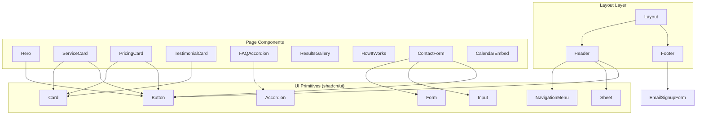

# Components

## Component List

### Layout Components

**Header**
- **Responsibility:** Sticky navigation bar with logo, main nav, mobile hamburger menu
- **Key Interfaces:** `NavItem[]`, `isMenuOpen` state
- **Dependencies:** Logo component, NavLink, MobileMenu
- **Technology Stack:** React, Tailwind, Headless UI (for mobile menu), shadcn/ui Sheet

**Footer**
- **Responsibility:** Site footer with contact info, social links, email signup, legal links
- **Key Interfaces:** `SiteConfig`, `EmailSignupForm`
- **Dependencies:** SocialIcons, EmailSignupForm, NavLink
- **Technology Stack:** React, Tailwind, ConvertKit embed

**Layout**
- **Responsibility:** Page wrapper combining Header + main + Footer
- **Key Interfaces:** `children: ReactNode`, `metadata?: PageMeta`
- **Dependencies:** Header, Footer, SEO component
- **Technology Stack:** Next.js layout pattern

### UI Components (shadcn/ui based)

**Button**
- **Responsibility:** Primary, secondary, outline button variants
- **Key Interfaces:** `variant`, `size`, `asChild`
- **Dependencies:** shadcn/ui Button primitive
- **Technology Stack:** React, Tailwind, Radix Slot

**Card**
- **Responsibility:** Content cards for services, pricing, testimonials
- **Key Interfaces:** `CardHeader`, `CardContent`, `CardFooter`
- **Dependencies:** shadcn/ui Card
- **Technology Stack:** React, Tailwind

**Accordion**
- **Responsibility:** Expandable FAQ items
- **Key Interfaces:** `AccordionItem`, `AccordionTrigger`, `AccordionContent`
- **Dependencies:** shadcn/ui Accordion (Radix)
- **Technology Stack:** React, Tailwind, Radix Accordion

**Sheet**
- **Responsibility:** Mobile navigation drawer
- **Key Interfaces:** `SheetTrigger`, `SheetContent`
- **Dependencies:** shadcn/ui Sheet (Radix Dialog)
- **Technology Stack:** React, Tailwind, Radix Dialog

**NavigationMenu**
- **Responsibility:** Desktop navigation with dropdowns
- **Key Interfaces:** `NavigationMenuItem`, `NavigationMenuTrigger`
- **Dependencies:** shadcn/ui NavigationMenu (Radix)
- **Technology Stack:** React, Tailwind, Radix NavigationMenu

### Page Section Components

**Hero**
- **Responsibility:** Homepage hero with headline, subheadline, CTAs, illustration
- **Key Interfaces:** `headline`, `subheadline`, `primaryCta`, `secondaryCta`, `imageUrl`
- **Dependencies:** Button, Next/Image
- **Technology Stack:** React, Tailwind, Next.js Image

**ServiceCard**
- **Responsibility:** Platform service overview card (Amazon/Etsy)
- **Key Interfaces:** `Service` type
- **Dependencies:** Card, Icon, Button
- **Technology Stack:** React, Tailwind

**PricingCard**
- **Responsibility:** Pricing package display with features list
- **Key Interfaces:** `PricingPackage` type
- **Dependencies:** Card, Button, CheckIcon
- **Technology Stack:** React, Tailwind

**TestimonialCard**
- **Responsibility:** Customer review display
- **Key Interfaces:** `Testimonial` type
- **Dependencies:** Card, Avatar
- **Technology Stack:** React, Tailwind

**FAQAccordion**
- **Responsibility:** FAQ section with expandable items
- **Key Interfaces:** `FAQ[]`
- **Dependencies:** Accordion
- **Technology Stack:** React, Tailwind, Radix

**ResultsGallery**
- **Responsibility:** Dashboard screenshot gallery
- **Key Interfaces:** `ResultProof[]`
- **Dependencies:** Next/Image, lightbox (optional)
- **Technology Stack:** React, Tailwind, Next.js Image

**HowItWorks**
- **Responsibility:** Step-by-step process visualization
- **Key Interfaces:** `steps: Step[]`
- **Dependencies:** Icon, custom step connector
- **Technology Stack:** React, Tailwind

### Form Components

**ContactForm**
- **Responsibility:** Contact form with validation and submission
- **Key Interfaces:** `onSubmit`, form fields
- **Dependencies:** shadcn/ui Form, Input, Textarea, Select, Button
- **Technology Stack:** React, Tailwind, React Hook Form, Zod, Formspree

**EmailSignupForm**
- **Responsibility:** Newsletter signup (footer + contact page)
- **Key Interfaces:** `onSubmit`, `email` field
- **Dependencies:** Input, Button
- **Technology Stack:** React, Tailwind, ConvertKit API

**CalendarEmbed**
- **Responsibility:** Consultation booking widget
- **Key Interfaces:** `calendarUrl`
- **Dependencies:** Cal.com embed script
- **Technology Stack:** React, Cal.com SDK

## Component Diagram

