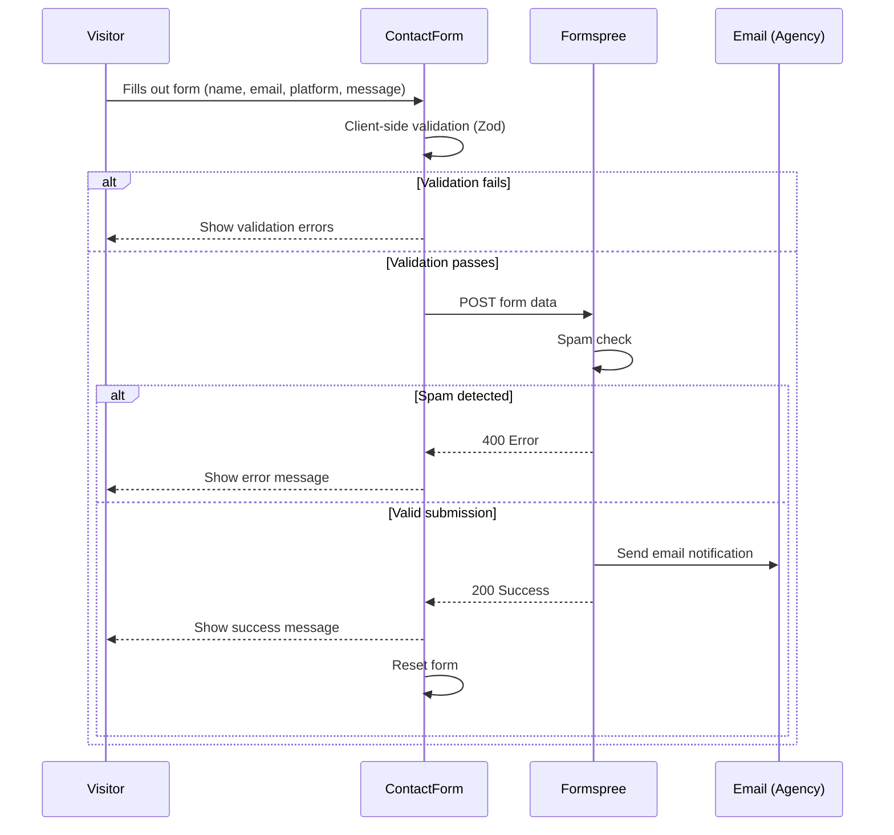
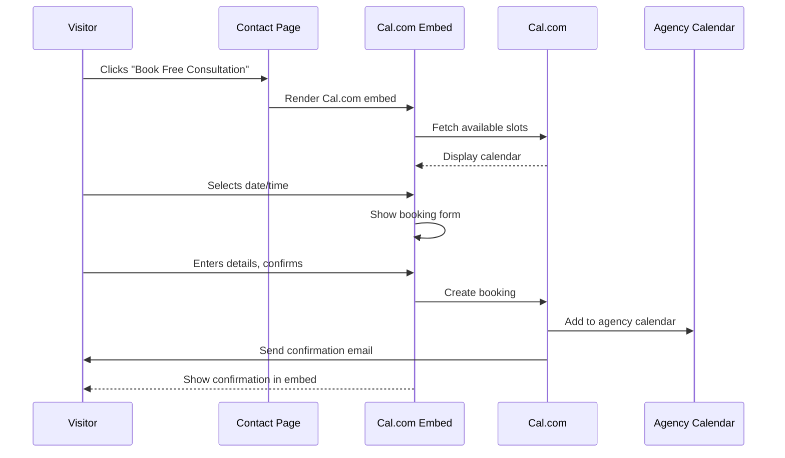
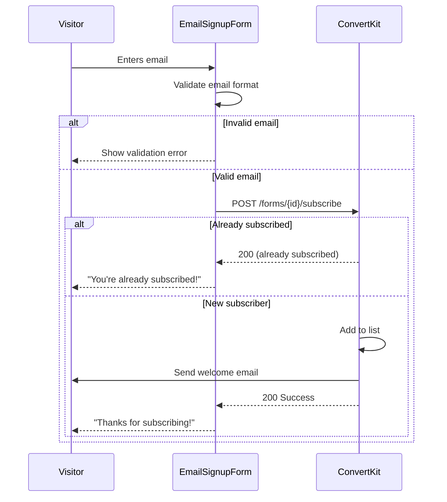
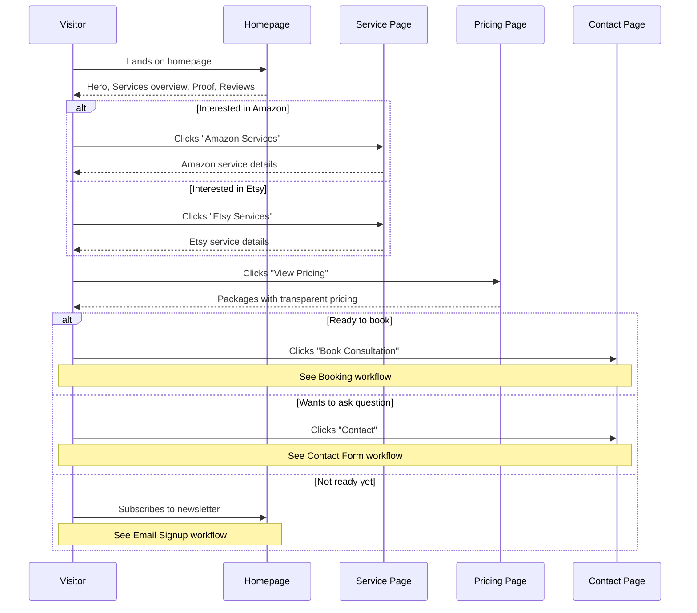

# Core Workflows

## Workflow 1: Contact Form Submission

```mermaid
sequenceDiagram
    participant V as Visitor
    participant CF as ContactForm
    participant FS as Formspree
    participant E as Email (Agency)

    V->>CF: Fills out form (name, email, platform, message)
    CF->>CF: Client-side validation (Zod)
    alt Validation fails
        CF-->>V: Show validation errors
    else Validation passes
        CF->>FS: POST form data
        FS->>FS: Spam check
        alt Spam detected
            FS-->>CF: 400 Error
            CF-->>V: Show error message
        else Valid submission
            FS->>E: Send email notification
            FS-->>CF: 200 Success
            CF-->>V: Show success message
            CF->>CF: Reset form
        end
    end
```

## Workflow 2: Consultation Booking

```mermaid
sequenceDiagram
    participant V as Visitor
    participant CP as Contact Page
    participant CE as Cal.com Embed
    participant CC as Cal.com
    participant AG as Agency Calendar

    V->>CP: Clicks "Book Free Consultation"
    CP->>CE: Render Cal.com embed
    CE->>CC: Fetch available slots
    CC-->>CE: Display calendar
    V->>CE: Selects date/time
    CE->>CE: Show booking form
    V->>CE: Enters details, confirms
    CE->>CC: Create booking
    CC->>AG: Add to agency calendar
    CC->>V: Send confirmation email
    CE-->>V: Show confirmation in embed
```

## Workflow 3: Email Newsletter Signup

```mermaid
sequenceDiagram
    participant V as Visitor
    participant ESF as EmailSignupForm
    participant CK as ConvertKit

    V->>ESF: Enters email
    ESF->>ESF: Validate email format
    alt Invalid email
        ESF-->>V: Show validation error
    else Valid email
        ESF->>CK: POST /forms/{id}/subscribe
        alt Already subscribed
            CK-->>ESF: 200 (already subscribed)
            ESF-->>V: "You're already subscribed!"
        else New subscriber
            CK->>CK: Add to list
            CK->>V: Send welcome email
            CK-->>ESF: 200 Success
            ESF-->>V: "Thanks for subscribing!"
        end
    end
```

## Workflow 4: Visitor Journey (Homepage to Lead)

```mermaid
sequenceDiagram
    participant V as Visitor
    participant HP as Homepage
    participant SP as Service Page
    participant PP as Pricing Page
    participant CP as Contact Page

    V->>HP: Lands on homepage
    HP-->>V: Hero, Services overview, Proof, Reviews

    alt Interested in Amazon
        V->>SP: Clicks "Amazon Services"
        SP-->>V: Amazon service details
    else Interested in Etsy
        V->>SP: Clicks "Etsy Services"
        SP-->>V: Etsy service details
    end

    V->>PP: Clicks "View Pricing"
    PP-->>V: Packages with transparent pricing

    alt Ready to book
        V->>CP: Clicks "Book Consultation"
        Note over V,CP: See Booking workflow
    else Wants to ask question
        V->>CP: Clicks "Contact"
        Note over V,CP: See Contact Form workflow
    else Not ready yet
        V->>HP: Subscribes to newsletter
        Note over V,HP: See Email Signup workflow
    end
```
