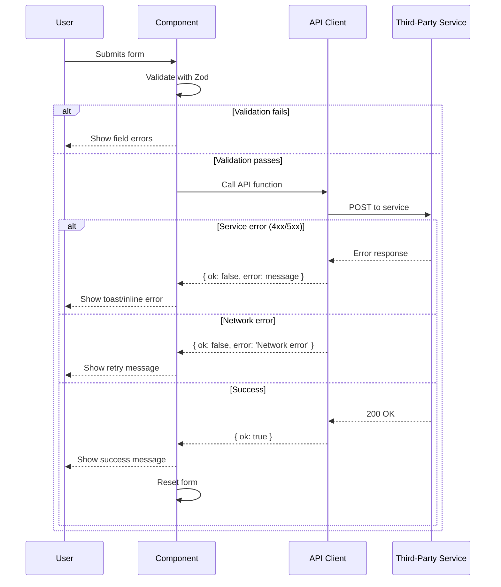

# Error Handling Strategy

## Error Flow



## Error Response Format

```typescript
// lib/api/types.ts

/**
 * Unified API response type for all third-party service calls.
 * Provides consistent success/error handling across the application.
 */
export interface ApiResponse<T = void> {
  /** Whether the operation succeeded */
  ok: boolean;
  /** Response data (if successful) */
  data?: T;
  /** Error message (if failed) */
  error?: string;
}
```

## Frontend Error Handling

```typescript
// components/forms/contact-form.tsx

import { useState } from 'react';
import { useForm } from 'react-hook-form';
import { zodResolver } from '@hookform/resolvers/zod';
import { z } from 'zod';
import { submitContactForm } from '@/lib/api/formspree';

const schema = z.object({
  name: z.string().min(1, 'Name is required'),
  email: z.string().email('Please enter a valid email'),
  platform: z.enum(['amazon', 'etsy', 'both']),
  message: z.string().min(10, 'Message must be at least 10 characters'),
});

type FormData = z.infer<typeof schema>;

/**
 * Contact form with validation and Formspree submission.
 * Displays inline validation errors and submission status.
 */
export function ContactForm() {
  const [status, setStatus] = useState<'idle' | 'submitting' | 'success' | 'error'>('idle');
  const [errorMessage, setErrorMessage] = useState<string>('');

  const form = useForm<FormData>({
    resolver: zodResolver(schema),
  });

  async function onSubmit(data: FormData) {
    setStatus('submitting');
    setErrorMessage('');

    const result = await submitContactForm(data);

    if (result.ok) {
      setStatus('success');
      form.reset();
    } else {
      setStatus('error');
      setErrorMessage(result.error || 'Something went wrong. Please try again.');
    }
  }

  return (
    <form onSubmit={form.handleSubmit(onSubmit)}>
      {/* Form fields with error display */}

      {status === 'error' && (
        <div role="alert" className="text-red-600 bg-red-50 p-4 rounded-md">
          {errorMessage}
        </div>
      )}

      {status === 'success' && (
        <div role="status" className="text-green-600 bg-green-50 p-4 rounded-md">
          Thank you! We'll be in touch soon.
        </div>
      )}

      <button type="submit" disabled={status === 'submitting'}>
        {status === 'submitting' ? 'Sending...' : 'Send Message'}
      </button>
    </form>
  );
}
```

## Error Categories

| Category | Example | Handling |
|----------|---------|----------|
| Validation Error | Invalid email format | Inline field error message |
| Network Error | No internet connection | Toast + retry suggestion |
| Service Error | Formspree down (500) | Inline error + contact email fallback |
| Rate Limit | Too many submissions | Friendly message + wait time |
