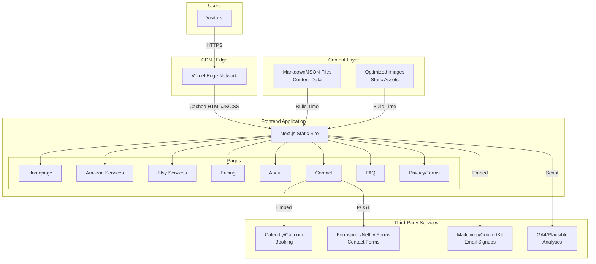

# High Level Architecture

## Technical Summary

This is a **static-generated Next.js website** deployed to Vercel, following JAMstack principles. The frontend is built with React/Next.js and Tailwind CSS, statically exported for optimal performance and SEO. There is no custom backend — all dynamic functionality (booking, forms, email capture, analytics) is handled through embedded third-party services. The architecture prioritizes sub-3-second load times, Lighthouse scores above 90, and seamless conversion paths from visitor to lead. Content is managed through file-based markdown/JSON, enabling non-technical updates without code deployments.

## Platform and Infrastructure Choice

**Platform:** Vercel
**Key Services:** Vercel Edge Network (CDN), Vercel Analytics (optional), GitHub Integration
**Deployment Regions:** Auto (Vercel's global edge network)

**Rationale for Vercel over alternatives:**

| Option | Pros | Cons |
|--------|------|------|
| **Vercel** ✓ | Native Next.js support, zero-config deploys, automatic SSL, global CDN, excellent DX | Vendor lock-in to Vercel-specific features if used |
| Netlify | Great for static sites, good form handling built-in | Less optimized for Next.js specifically |
| AWS (S3 + CloudFront) | Full control, enterprise scale | Overkill for this project, more complex setup |

**Decision:** Vercel is the optimal choice given Next.js is the framework and the PRD explicitly lists "Vercel or Netlify" as recommended. Vercel's native Next.js integration provides the best developer experience and performance optimization.

## Repository Structure

**Structure:** Monorepo (single repository)
**Monorepo Tool:** N/A — npm workspaces not needed for this scale
**Package Organization:** Flat structure with clear directory separation

The PRD specifies a monorepo containing "all website code, components, content, and configuration." Given this is a single Next.js application with no backend services, a simple flat structure is appropriate rather than a multi-package monorepo.

## High Level Architecture Diagram

## Architectural Patterns

- **JAMstack Architecture:** Pre-rendered static pages with client-side JavaScript for interactivity and third-party APIs for dynamic features — *Rationale:* Maximizes performance (static files served from CDN), improves SEO (fully rendered HTML), and reduces infrastructure complexity (no server to manage)

- **Static Site Generation (SSG):** All pages pre-built at build time using Next.js static export — *Rationale:* Meets the <3 second load time requirement and Lighthouse >90 targets; content doesn't change frequently enough to require ISR or SSR

- **Component-Based UI:** Reusable React components with TypeScript for type safety — *Rationale:* Enables consistent UI across pages, reduces duplication, and provides developer confidence through type checking

- **File-Based Content Management:** Content stored in markdown/JSON files within the repository — *Rationale:* PRD specifies "simple file-based system" for non-technical updates; avoids headless CMS complexity for MVP while allowing content changes via PR

- **Third-Party Service Integration:** All dynamic functionality (forms, booking, email, analytics) delegated to specialized services — *Rationale:* Eliminates need for custom backend, reduces development time, leverages battle-tested solutions for critical conversion paths

- **Mobile-First Responsive Design:** Tailwind CSS utility classes with mobile-first breakpoints — *Rationale:* PRD requires "full mobile responsiveness"; mobile-first ensures touch targets and layouts work on smallest screens first
